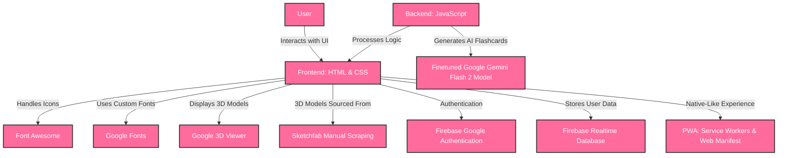

# **smARties.ai**

**Making learning magical for kids through AI & AR!**

**smARties.ai** is an interactive **AI & AR-based early education platform** that empowers young children to **learn through play, explore with technology, and boost knowledge retention** using immersive 3D models, augmented reality, and personalized AI-driven flashcards.

## 🚀 **Demo**

[Live Demo >](https://smarties-ai.web.app/)

> **Note:** API keys and database credentials have been omitted from the codebase for security reasons. Use the demo link above to explore the features.

---

## 🎯 **Problem Statement**

Making early education engaging, accessible, and effective for young children is a major challenge. **Short attention spans, lack of interactivity, limited access to quality educational resources, and one-size-fits-all teaching methods** often lead to **reduced learning outcomes and disengagement**. Traditional learning platforms and classroom methods struggle to **personalize learning, stimulate curiosity, and leverage technology effectively** for young learners.

**smARties.ai** **combines AI and AR technologies to address these challenges**, creating a fun, interactive, and highly personalized learning environment that **boosts retention, encourages exploration, and makes education magical for kids aged 2–8**.

---

## ✨ **Key Features**  

### **Interactive 3D Models**  

> **Explore real-world objects with detailed 3D models that children can rotate, scale and interact with to understand shapes, forms and relationships.**

### **Augmented Reality**  

> **Experience learning that jumps off the screen and into the real world with our AR mode, allowing children to place virtual objects in their environment.**

### **AI Flashcards**  

> **Generate personalized educational flashcards for each object, created by AI to deliver age-appropriate facts that boost knowledge retention.**

### **Audio Learning**  

> **Enhance pronunciation and auditory learning with our text-to-speech feature that clearly articulates each object's name for improved language development.**

### **Diverse Learning Categories**  

> **Comprehensive learning across essential early education topics like Animals, Shapes, Transport, Fruits, Vegetables, Alphabets, Counting, Colors, and Body Parts to build a strong foundation for young minds.**

### **Multi-Sensory Learning**  

> **Engage visual, auditory, and interactive senses simultaneously for improved learning outcomes and memory retention in early childhood development.**

### **Child-Friendly Interface**  

> **Intuitive, colorful design with large buttons and simple navigation that children aged 2-8 can easily use independently or with minimal parental guidance.**

### **Multi-Platform Access**  

> **Available across all devices, including iOS and Android mobile apps, web apps for desktop and mobile browsers, and dedicated PWA desktop app, ensuring learning can happen anywhere.**

### **Privacy-Focused**  

> **Simple Google sign-in with strict privacy controls to protect your child's information while providing a personalized learning experience.**

---

## 🛠️ **Technology Stack**

- **Frontend:** HTML + CSS  
- **Backend:** JavaScript  
- **3D Model loading:** Google 3D Viewer  
- **Icons:** Font Awesome  
- **Fonts:** Google Fonts  
- **Database:** Firebase RTDB  
- **Auth:** Firebase Google Authentication  
- **AI Flashcards:** Finetuned Gemini Flash 2  
- **3D Models:** Manual scraping from Sketchfab
- **PWA (Progressive Web App):** Native-like Experience

---

## 📋 **Impact & Benefits**

- **Learning That Feels Like Play:** Interactive 3D models and AR experiences make education exciting, helping children stay engaged and curious.

- **Personalized Learning Journeys:** AI-driven flashcards and activities adapt to each child's pace and interests, boosting confidence and comprehension.

- **Boosts Early Cognitive Development:** Multisensory learning techniques enhance memory, critical thinking, and problem-solving skills in young minds.

- **Accessible Anywhere, Anytime:** Cross-platform access ensures kids can learn from home, school, or on the go, making quality education more inclusive.

- **Safe, Kid-Friendly Environment:** Designed with privacy and safety in mind, smARties.ai ensures a secure, ad-free space for young learners.

- **Comprehensive Educational Coverage:** Covers 9 essential early learning categories including alphabets, numbers, animals, shapes, fruits, vegetables, colors, body parts, and transportation.

- **Intuitive and Engaging UI:** A colorful, simple, and touch-friendly design that makes navigation effortless and fun for young children.

---

## 🚀 Getting Started

### Requirements:
- A modern web browser with JavaScript enabled.
- Stable internet connection for loading media and syncing data.

### Steps:
1. Download the app from website.
2. Sign-up to make your account.
3. Begin your interactive AI & AR based learning with smARties.ai!

---

## 🤝 **Contributing**  

Contributions are always welcome! Please follow these steps:

1. Fork the repository.  
2. Create a new branch (`git checkout -b feature/your-feature`).  
3. Commit your changes (`git commit -m 'Add your message'`).  
4. Push to the branch (`git push origin feature/your-feature`).  
5. Open a pull request.  

---

Built with ❤️ to make early learning smarter, more fun, and more engaging with AI and AR.
